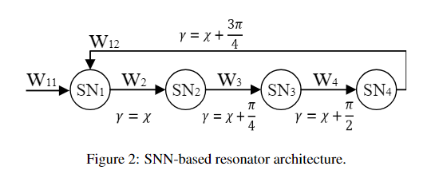
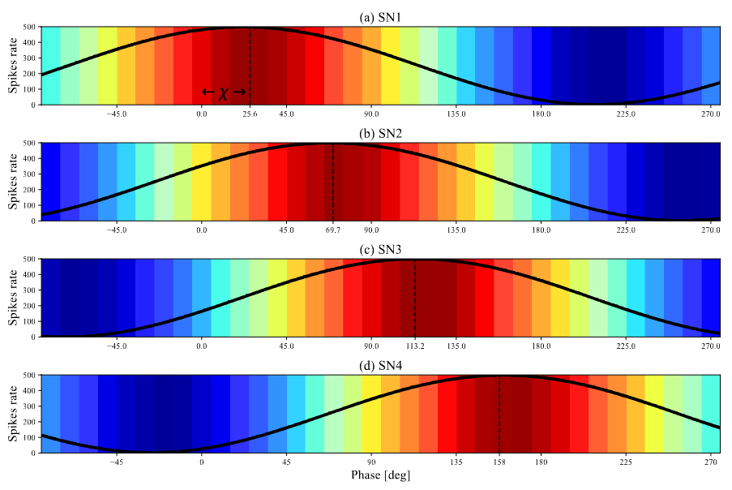
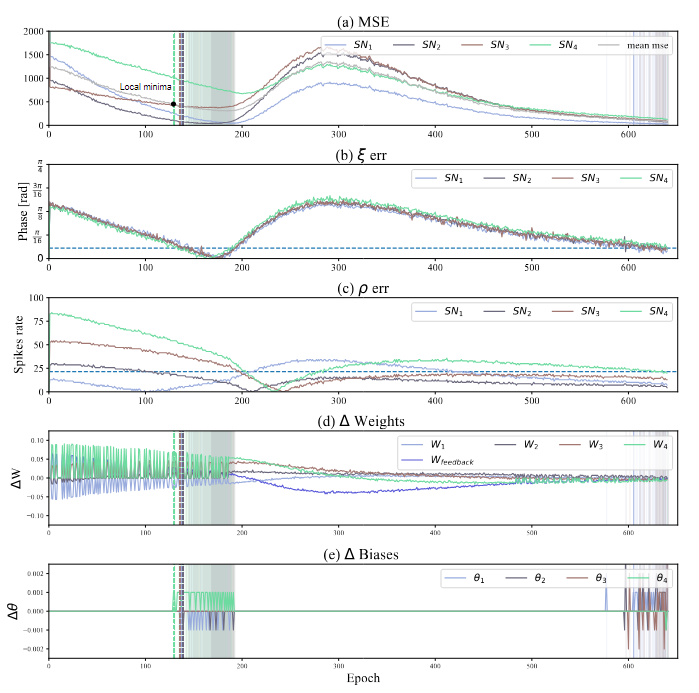
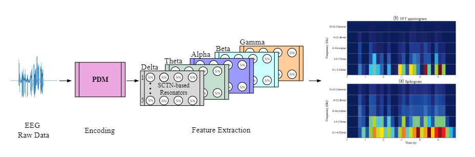

# Time-Frequency Analysis Using Spiking Neural Network


### Requirements
For this code examples all you need is the [SCTN](https://github.com/NeuromorphicLabBGU/SCTN/tree/main) package that implement the spiking neuron that use as a building block of the resonator. 
```bash
pip install sctn
```

### Examples
#### time_frequency_analasys
A notebook with simulation of how the resonator architecture and simulation of its response.

#### resonator_training
A notebook with a simulation of the training process to achieve the weights and biases of the resonator to frequency `f0`


#### Resonator Architecture


#### Phase Shifting Neurons Output


#### Resonator Neurons Training Process


#### Features Extractions Example


