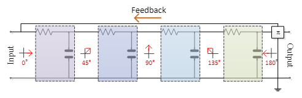
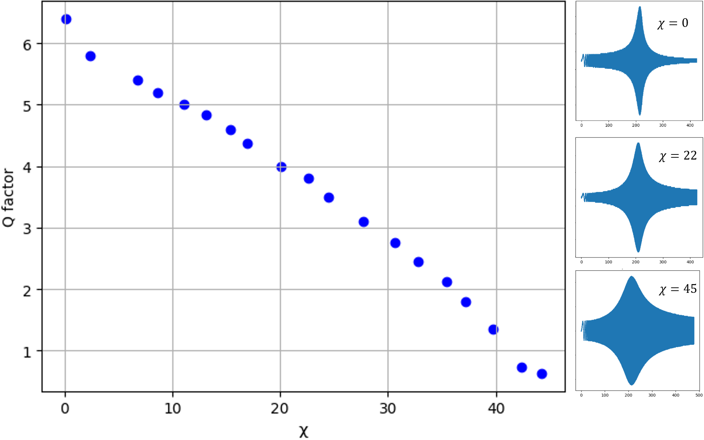

# Time Frequency Analasys

Time-frequency analysis plays a crucial role in various fields, including signal processing and feature extraction.
In this article, we propose an alternative and innovative method for time-frequency analysis using a biologically inspired spiking neural network (SNN), encompassing both specific spike-continuous-time-neuron (SCTN) based neural architecture and an adaptive learning rule. We aim to efficiently detect frequencies embedded in a given signal for the purpose of feature extraction.
To achieve this, we suggest using an SN-based network functioning as a resonator for the detection of specific frequencies.
We developed a modified supervised Spike-Timing-Dependent Plasticity (STDP) learning rule to effectively adjust the network parameters.
Unlike traditional methods for time-frequency analysis, our approach obviates the need to segment the signal into several frames, resulting in a streamlined and more effective frequency analysis process. Simulation results demonstrate the efficiency of the proposed method, showcasing its ability to detect frequencies and generate a Spikegram akin to the Fast Fourier Transform (FFT) based spectrogram. The proposed approach is applied to analyzing EEG signals, demonstrating an accurate correlation to the equivalent FFT transform.
Results show a success rate of 94.3% in classifying EEG signals.

